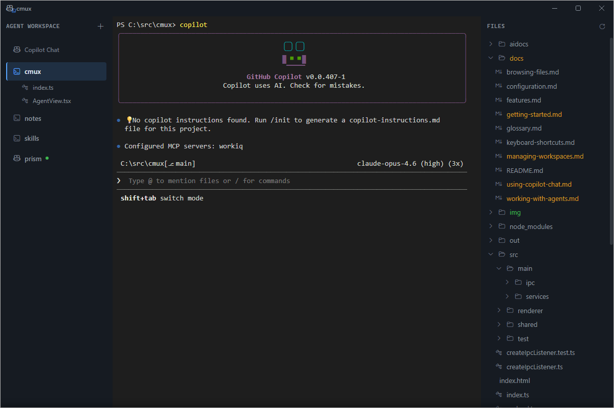
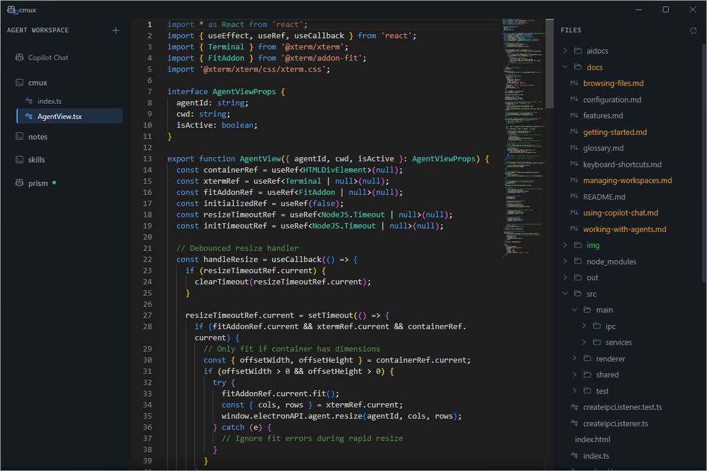

# Browsing Files

The Explorer (right pane) shows the file tree for the selected workspace or agent's directory. Click files to view them with syntax highlighting in Main View.

## Navigate the File Tree

- **Expand a folder** — click the folder name or chevron
- **Collapse a folder** — click again
- Folders load their contents lazily, so large directories stay responsive

The Explorer always shows the directory of the currently selected workspace or agent, even when you're viewing a file.

## Open a File

Click any file in the Explorer. This:

1. Opens the file in **Main View** with syntax highlighting (Monaco Editor)
2. Adds the file as a nested item under its workspace in the **Navigator**

Supported languages include TypeScript, JavaScript, JSON, Markdown, CSS, HTML, Python, YAML, and more.

## Switch Between Files and Terminal

- Click a **file** in the Navigator → Main View shows the file
- Click the **workspace** in the Navigator → Main View returns to the terminal
- The Explorer stays on the workspace's directory regardless of what's shown in Main View

## Close a File

Right-click the file in the Navigator and select **Close**, or press `Ctrl+W` while viewing the file. This removes it from the Navigator and returns Main View to the workspace terminal.

## Refresh the File Tree

Click the **refresh** button in the Explorer header to reload the directory listing. The tree also auto-refreshes when files change on disk.
