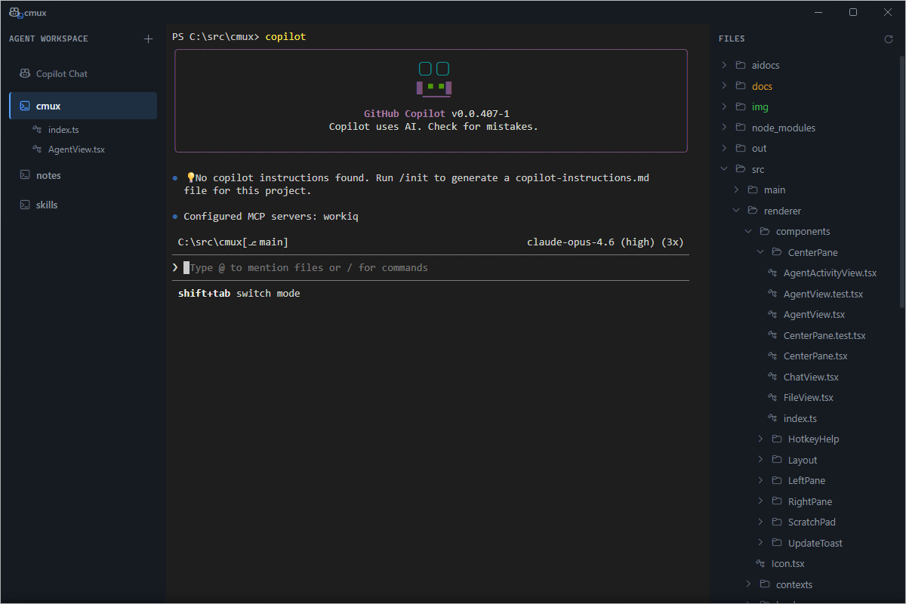
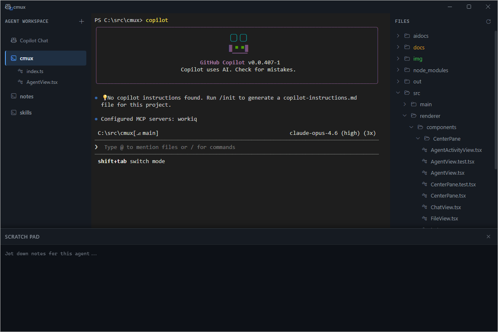

# Managing Workspaces

Workspaces are terminal sessions scoped to a directory. Each workspace appears in the Navigator and shows its terminal in Main View.

## Create a Workspace

1. Click the **`+`** button in the Navigator header
2. Pick a directory — this becomes the workspace's working directory
3. The workspace appears in the Navigator and its terminal loads in Main View
4. The Explorer updates to show the selected directory's file tree

## Switch Between Workspaces

Click any workspace in the Navigator. This updates:
- **Main View** — switches to that workspace's terminal
- **Explorer** — shows that workspace's file tree

Workspace terminals preserve their state when you switch away and back.

### Keyboard Shortcuts

| Action | Shortcut |
|--------|----------|
| Next workspace | `Ctrl+Tab` |
| Previous workspace | `Ctrl+Shift+Tab` |
| New workspace | `Ctrl+Alt+\` |
| Close workspace | `Ctrl+W` |

## Rename a Workspace

1. Right-click the workspace in the Navigator
2. Select **Rename**
3. Type a new name and press `Enter`

Or select a workspace and press `F2`.

## Close a Workspace

1. Right-click the workspace in the Navigator
2. Select **Close**

This kills the terminal process and removes the workspace from the Navigator. Any files opened under that workspace are also closed.

## Use the Scratch Pad

Each workspace has a **Scratch Pad** — a quick notepad for jotting down notes, commands, or context while you work.

- Press `Ctrl+J` to toggle the Scratch Pad open/closed
- Notes are saved per workspace, so each workspace has its own scratch pad
- Use it to keep track of TODOs, paste snippets, or plan your next steps

## Open Files Under a Workspace

When you click a file in the Explorer, it opens in Main View and appears nested under the workspace in the Navigator. See [Browsing Files](browsing-files.md) for details.
