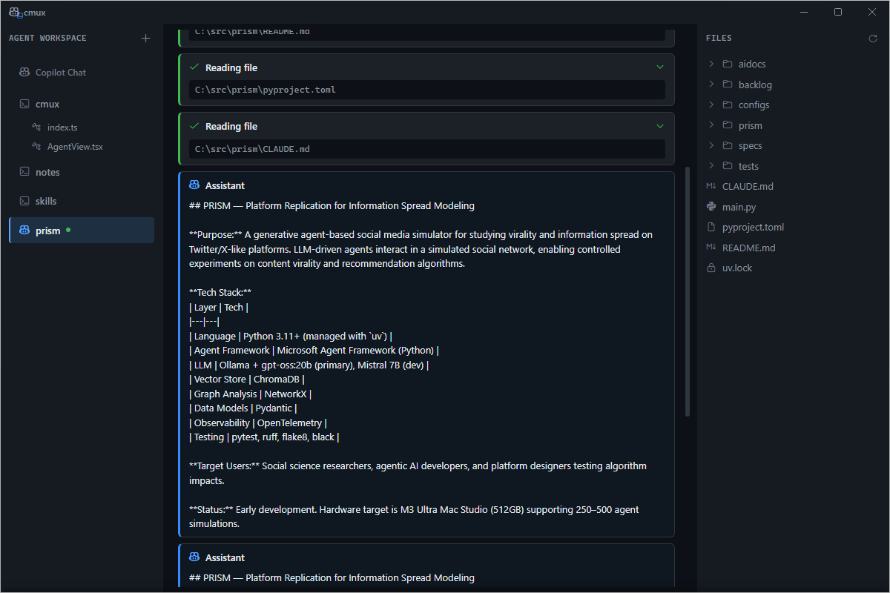

# Working with Agents

Agents are AI-powered sessions created from Copilot Chat. They work autonomously in a repository and show their progress in an activity feed.

## Create an Agent

1. Click **Copilot Chat** in the Navigator to open Chat in Main View
2. Describe what you want, including a directory path:

   > Create an agent for ~/src/my-project and fix the failing tests

3. Chat creates the agent automatically. A new entry appears in the Navigator with:
   - A **copilot icon** (distinguishing it from workspaces)
   - A **status dot** — green (idle), yellow pulsing (working), red (error)

## Monitor Agent Activity

Click the agent in the Navigator. Main View shows the **activity feed** — a card-based UI with:

- **Tool cards** — shows each tool call (file reads, edits, shell commands) with a spinner while running, ✓ on success, ✗ on failure. Click to expand results.
- **Assistant messages** — the agent's reasoning and explanations
- **Error cards** — red alerts when something goes wrong
- **Done card** — green confirmation when the agent finishes

The Explorer updates to show the agent's working directory, so you can browse the files it's modifying.

## Send Follow-Up Tasks

Switch back to Chat and send another message:

> Now run the tests and fix anything that breaks

Chat routes the task to the agent. The activity feed lights up again with new tool calls and results.

## Manage Multiple Agents

Create as many agents as you need, each in a different directory:

> Create an agent for ~/src/api and update the endpoints

Each agent appears separately in the Navigator. Click between them to see their individual activity feeds.

## Check Agent Status

Ask Chat:

> List my agents

Chat reports all agents with their current state (idle, working, error).

## Agents vs Workspaces

| | Workspace | Agent |
|---|-----------|-------|
| Created via | `+` button | Copilot Chat |
| Main View shows | Terminal | Activity feed |
| Interaction | Type commands directly | Send tasks via Chat |
| Icon in Navigator | Terminal icon | Copilot icon + status dot |
